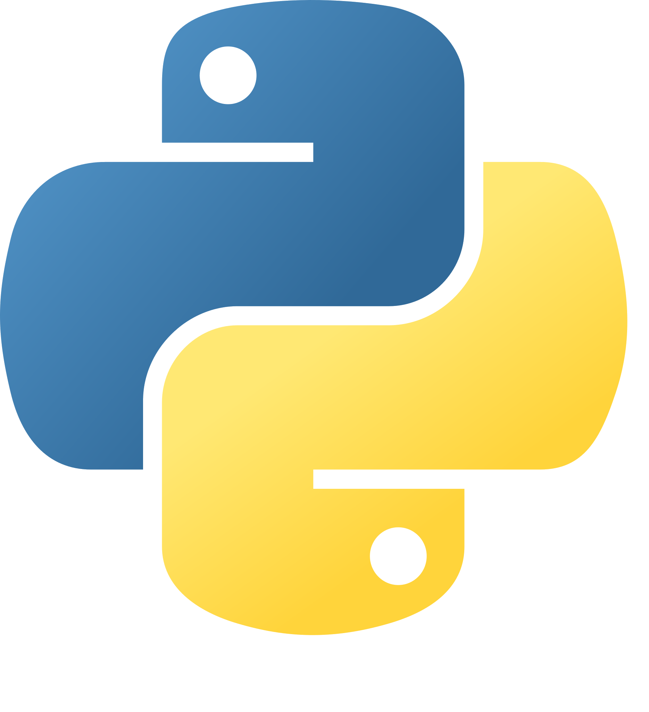

### Hi there! 

I'm **Rémi DEL MEDICO**, a computer science engineering student at **Polytech Grenoble**, part of **Université Grenoble Alpes**.

Since discovering the power of coding and development, I've been deeply fascinated by technology and innovation. I'm dedicated to continually developing my skills and bringing creative, efficient solutions to life.
I always try to improve myself while taking a lot of fun by developing new projects! 😁

Driven by curiosity and a commitment to make a positive impact, I aim to use my technical expertise to tackle real-world challenges. Whether coding a new feature, working on complex algorithms, or optimizing for better performance, I approach each project with an open mind and enthusiastic spirit.

[Check out my online portfolio here!](https://rdel-medico.github.io/Portfolio/)

## Technologies and Tools

In my projects, I primarily use Java, but I’m also skilled in several other languages and tools, thanks to school projects, internships, and personal explorations:

| <h3>Category</h3> | <h3>Technologies</h3> |
| :------: | ------ |
| <h4>Tools</h4> | 
     
 |
| <h4>Algorithmic (Object-Oriented / Functional / Imperative)</h4> | 
    
 |
| <h4>Back-End</h4> | 
 
 |
| <h4>Front-End</h4> | 
  
 |

## Youtube
I enjoy creating video presentations of some of my projects! Feel free to check them out:

