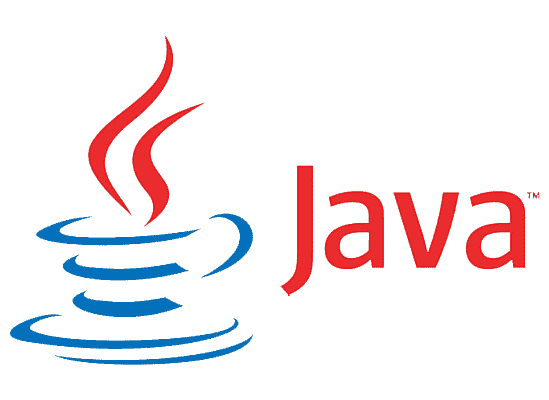

### Hi there! 

I'm a french engineering student at **Polytech Grenoble**.

Passionate about computer science since I discovered this field.
I always try to improve myself while taking a lot of fun by developing new projects! 😁

For my personal projects I mainly use **Java**.
But I know how to code in many languages and know how to use many tools thanks to others projects, school projects and internship:

| <h3>Category</h3> | <h3>Technologies</h3> |
| :------: | ------ |
| <h4>Tools</h4> | 
    
 |
| <h4>Algorithmic (Object-Oriented / Functional / Imperative)</h4> | 
   
 |
| <h4>Back-End</h4> | 
 
 |
| <h4>Front-End</h4> | 
  
 |

## Youtube
On some projects I like to do a presentation video, check this out there : 

